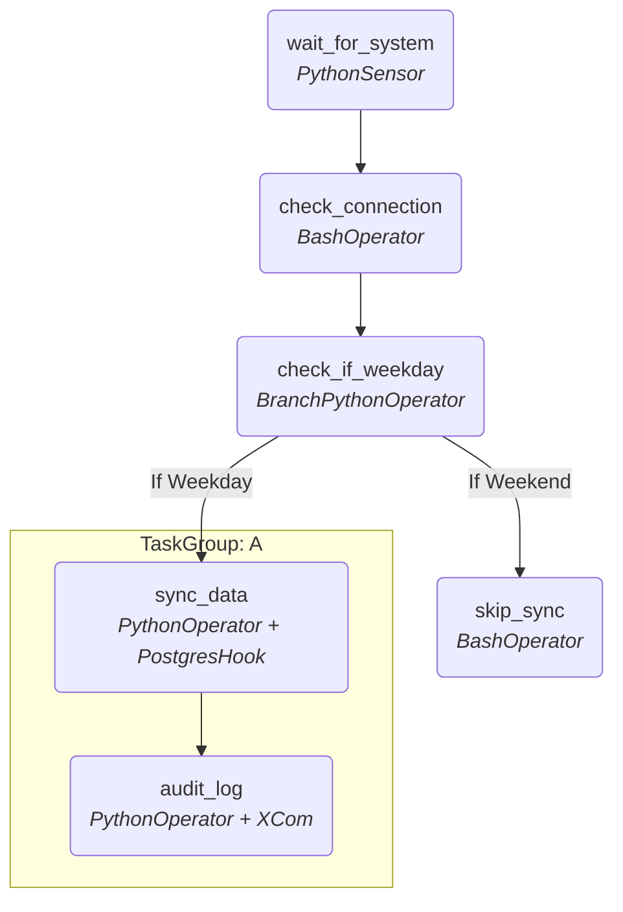

# Airflow Orchestration Learning Journey

This repository contains a fully functional Apache Airflow DAG that demonstrates core data engineering orchestration patterns.

## Concepts Mastered in `warehouse_sync_pipeline.py`

* **DAG Architecture:** Defining default arguments, retry logic, and scheduling (`@hourly`).
* **Sensors:** Using `PythonSensor` to pause pipeline execution until external systems are ready (event-driven architecture).
* **Branching:** Using `BranchPythonOperator` to dynamically route task execution (e.g., skipping heavy syncs on weekends).
* **XComs:** Passing metadata (like database row counts) between isolated tasks safely using `ti.xcom_pull`.
* **Hooks:** Securely querying external databases (`PostgresHook`) without hardcoding credentials in the script.
* **Jinja Templating:** Injecting dynamic runtime variables (like `{{ ds }}` for the execution date) directly into bash commands.
* **TaskGroups:** Visually organizing related tasks into collapsible folders in the Airflow UI to keep large DAGs readable.
* **Alerting & SLAs:** Setting up automatic Slack webhook notifications for task failures and defining maximum execution time limits (SLAs).

## DAG Execution Flow

## How to Run This Locally

To actually execute this code, you need an Airflow environment. The easiest way to run this locally is using the [Astronomer CLI (Astro CLI)](https://docs.astronomer.io/astro/cli/overview) which spins up Airflow inside Docker containers.